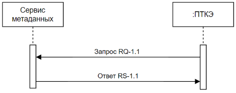

![ref1]

**Created with an evaluation copy of Aspose.Words. To remove all limitations, you can use Free Temporary License [https://products.aspose.com/words/temporary-license/**](https://products.aspose.com/words/temporary-license/)**

Министерство науки и высшего образования РФ
Федеральное государственное бюджетное образовательное учреждение высшего образования

` `«Волгоградский государственный технический университет»  

(ВолгГТУ)

**УТВЕРЖДАЮ:*** 

И.о.  ректора  ФГБОУ  ВО «ВолгГТУ» 

д.х.н., профессор 

`                             `(должность)

А.В. Навроцкий         (подпись)                (ФИО) 

**Технический отчет** 

**«Техническое задание на разработку программного модуля ПТК 
«Эксплуатация» - «Модуль анализа работы устройств РЗА на основании данных, получаемых в соответствии с положениями отчета МЭК 61850- 90-2»** 

Этап №1  

Редакция №1 

Руководитель работы 

Заведующий кафедрой «САПРиПК»,  

д.т.н., проф. 

`                          `\_\_\_\_\_\_\_\_\_\_\_  Щербаков М.В.  

Количество страниц: 31 Волгоград, 2024 г. 

**Evaluation Only. Created with Aspose.Words. Copyright 2003-2024 Aspose Pty Ltd.**
![ref2]14 

СПИСОК ИСПОЛНИТЕЛЕЙ 

|Наименование организации |Должность, Ф.И.О. |Подпись |Дата |
| :- | - | - | - |
|ФГБОУ ВО «ВолгГТУ» |Заведующий кафедрой «САПРиПК», д.т.н., проф. Щербаков М.В. |||
|ФГБОУ ВО «ВолгГТУ» |Лаборант-исследователь Козина С.А. |||
|ФГБОУ ВО «ВолгГТУ» |Инженер-исследователь Спрыгин Д.М. |||
**СОДЕРЖАНИЕ** 

1. [**Термины и определения** ........................................................................ 7](#_page6_x82,00_y56,92)
1. [**Общие термины** ...................................................................................... 7](#_page6_x82,00_y80,92)
1. [**Бизнес-термины** ...................................................................................... 7](#_page6_x82,00_y419,92)
1. [**Технические термины** ............................................................................ 8](#_page7_x82,00_y225,92)
1. [**Другие термины** ...................................................................................... 8](#_page7_x82,00_y491,92)
2. [**Общие положения** ................................................................................... 9](#_page8_x82,00_y56,92)
1. [**Назначение документа** ........................................................................... 9](#_page8_x82,00_y80,92)
1. [**Цели разработки продукта** .................................................................... 9](#_page8_x82,00_y346,92)
1. [**Основные функциональные возможности продукта** ...................... 10](#_page9_x82,00_y467,92)
3. [**Функциональные требования** ............................................................ 12](#_page11_x82,00_y56,92)
1. [**Диаграмма деятельности модулей** ..................................................... 12](#_page11_x82,00_y80,92)
1. [**Функциональные требования к сервисам** ........................................ 12](#_page11_x82,00_y698,92)
1. [Описание сервиса «Сервис метаданных» ......................................... 12](#_page11_x82,00_y722,92)
1. [Описание сервиса «Сервис анализа работы».................................... 14](#_page13_x82,00_y346,92)

   3. [**Математическое обеспечение продукта** ............................................ 16](#_page15_x82,00_y274,92)
   3. [**Информационное обеспечение продукта** .......................................... 16](#_page15_x82,00_y420,92)
   3. [**Дополнительные функциональные требования** .............................. 16](#_page15_x82,00_y666,92)
4. [**Требования к API**.................................................................................. 17](#_page16_x82,00_y56,92)
1. [**Общий механизм авторизации запросов к API** ................................ 17](#_page16_x82,00_y80,92)
1. [**Система идентификации и аутентификации** ................................... 17](#_page16_x82,00_y203,92)
1. [**Пример взаимодействия по REST API** .............................................. 17](#_page16_x82,00_y276,92)
5. [**Нефункциональные требования** ........................................................ 18](#_page17_x82,00_y56,92)
1. [**Требования к производительности** .................................................... 18](#_page17_x82,00_y80,92)
1. [**Требования к безопасности** ................................................................. 18](#_page17_x82,00_y177,92)
3. [**Эксплуатационные требования** .......................................................... 18](#_page17_x82,00_y370,92)
3. [**Требования к документации** ............................................................... 18](#_page17_x82,00_y563,92)
6. [**Требования к приемке-сдаче проекта** ............................................... 20](#_page19_x82,00_y56,92)
6. [**История изменения документа** ........................................................... 21 ](#_page20_x82,00_y56,92)[СПИСОК ИСПОЛЬЗОВАННЫХ ИСТОЧНИКОВ .......................................... 22 ](#_page21_x82,00_y56,92)[ .................................................................................................... 23 ](#_page22_x82,00_y56,92)[А.1 Формат запроса к сервису метаданных ...................................................... 23 ](#_page22_x82,00_y151,92)[А.2 Формат ответа от сервиса метаданных ...................................................... 23 ](#_page22_x82,00_y299,92)[А.3 Входные данные сервиса ............................................................................ 23 ](#_page22_x82,00_y521,92)[А.4 Выходные данные сервиса .......................................................................... 23](#_page22_x82,00_y593,92)

[ ..................................................................................................... 25 ](#_page24_x82,00_y56,92)[Б.1 Формат запроса к сервису анализа работы устройств РЗА ....................... 25](#_page24_x82,00_y171,92)

[Б.2  Формат  ответа  от  сервиса  анализа  правильности  выбора  параметров срабатывания устройств РЗА............................................................................. 25](#_page24_x82,00_y511,92)

[Б.3 Входные данные сервиса ............................................................................. 26 ](#_page25_x82,00_y106,92)[Б.4 Выходные данные сервиса .......................................................................... 29 ](#_page28_x82,00_y137,92)[ .................................................................................................... 31](#_page30_x82,00_y56,92)

**ПЕРЕЧЕНЬ СОКРАЩЕНИЙ И ОБОЗНАЧЕНИЙ** 

В настоящем отчете о НИОКР применяют следующие сокращения и обозначения: 

АРМ  –  Автоматизированное рабочее место 

АСУ ТП  –  Автоматизированная  система  управления 

технологическими процессами 

БД  –  База данных 

ИА  –  Исполнительный аппарат 

КЗ  –  Короткое замыкание 

ЛЭП  –  Линия электропередачи 

МП  –  Микропроцессорный 

МПУ  –  Модуль производителей устройств РЗА 

МЭС  –  Магистральные электрические сети 

НИОКР  –  Научно-исследовательская и опытно-конструкторская 

работа 

ПА  –  Противоаварийная автоматика 

ПАМИ  –  Подсистема автоматического мониторинга измерений ПК  –  Программный комплекс 

ПМЭС  –  Предприятие магистральных электрических сетей 

ПО  –  Программное обеспечение 

ППР  –  Подсистема  автоматизированного  выбора  точек 

короткого замыкания и поиска расчетных режимов ППРМЭС  –  Подсистема  построения  расчетной  модели  схемы 

электрической сети для расчёта токов КЗ 

ПРУ  –  Подсистема  хранения  параметров  и  результатов 

расчета уставок 

ПС  –  Подстанция 

ПТК  –  Программно-технический комплекс 

ПТКЗ  –  Подсистема расчета токов короткого замыкания 

ПТКЭ  –  ПТК «Эксплуатация» 

РАС  –  Регистратор аварийных событий 

РЗА  –  Релейная защита и автоматика 

СИ  –  Средство измерения 

СОПТ  –  Система оперативного постоянного тока 

СУБД  –  Система управления базами данных 

ТО  –  Техническое обслуживание 

ТОиР  –  Техническое обслуживание и ремонт 

ЭК  –  Электронный каталог 

ЭМ   –  Электромеханический 

API  –  Application  programming  interface  (интерфейс программирования приложений) 

CIM  –  Common  Information  Model  (общая  информационная 

модель) 

HTTP  –  HyperText  Transfer  Protocol  (протокол  передачи 

гипертекста)  –  протокол  прикладного  уровня передачи  данных,  изначально  —  в  виде гипертекстовых  документов  в  формате  HTML,  в настоящее  время  используется  для  передачи произвольных данных 

JSON  –  JavaScript Object Notation (текстовый формат обмена 

данными,  основанный  на  JavaScript)  –  формат  для хранения  и  обмена  информацией,  доступной  для чтения человеком 

REST   –  Representational  state  transfer  (стиль  архитектуры 

программного  обеспечения  для  распределенных систем, таких как World Wide Web) 

1. **Термины и определения** 
1. **Общие термины** 

**Данные** – предоставление информации в формальном виде, пригодном для передачи, интерпретации или обработки людьми или компьютерами. 

**Нормативный  документ**  –  документ,  устанавливающий  правила, общие  принципы  или  характеристики,  касающиеся  различных  видов деятельности или их результатов. 

**Программно-технический  комплекс  (ПТК)**  –  совокупность  средств вычислительной  техники, программного обеспечения и средств создания  и заполнения машинной информационной базы при вводе системы в действие, достаточных  для  выполнения  одной  или  более  задач  автоматизированной системы.** 

**Сервис**  –  программный  компонент,  реализующий  законченную функцию предоставления или обработки данных. 

2. **Бизнес-термины** 

**Модуль производителей устройств РЗА** – законченный программный продукт, разработанный производителями устройств РЗА, который содержит специализированные сервисы и поставляется в виде образа контейнера. 

**Модуль анализа работы устройств РЗА**  – это программный модуль, разрабатываемый  в  рамках  настоящего  технического  задания.  Он предназначен  для  анализа  работы  устройств  РЗА  с  целью  выявления аномалий  и  оптимизации  работы  устройств  РЗА  на  основании  данных, получаемых в соответствии с положениями МЭК 61850-90-2, и ПТКЭ. 

**Устройство РЗА** – техническое устройство (аппарат, терминал, блок, шкаф,  панель)  и  его  цепи,  реализующее  заданные  функции  РЗА  и обслуживаемое (оперативно и технически) как единое целое. 

**АСУ  ТП**  –  система,  состоящая  из  персонала  и  комплекса  средств автоматизации его деятельности, реализующая информационную технологию выполнения  функций  управления  конкретным  управляющим  объектом (процессом). 

**Терминал**  –  микропроцессорное  многофункциональное  устройство, выполняющее  функции  РЗА,  конечного  элемента  управления  и  источника информации для автоматизированной системы управления технологическими процессами объекта электроэнергетики.  

3. **Технические термины** 

**Таблица измерений** – таблица в структуре многомерной базы данных, которая  содержит  атрибуты  событий,  сохраненных  в  таблице  фактов. Атрибуты  представляют  собой  текстовые  или  иные  описания,  логически объединенные в одно целое.  

**Таблица  фактов**  –  является  основной  таблицей  хранилища  данных. Как  правило,  она  содержит  сведения  об  объектах  или  событиях, совокупность которых будет в дальнейшем анализироваться. 

**Медленно  меняющиеся  измерения**  –  механизм  отслеживания изменений в данных измерения. 

4. **Другие термины** 

**Продукт (Система)** – программный модуль анализа работы устройств РЗА на основании данных, получаемых в соответствии с положениями отчета МЭК 61850-90-2 ПТКЭ. 

**Разработчик**  –  исполнитель  НИОКР,  выполняющий  работы  по внедрению и доработке Продукта. 

**Заказчик**  –  обладатель  исключительных  прав  на  Продукт, реализующий проект по его пилотной эксплуатации. 

2. **Общие положения** 
1. **Назначение документа** 

В  настоящем  документе  приводится  полный  набор  требований  к разработке Продукта. 

Подпись  Заказчика  и  Разработчика  на  настоящем  документе подтверждает их согласие с нижеследующими фактами и условиями: 

1. При  реализации  необходимо  выполнить  работы  в  объёме, 

указанном в настоящем Техническом Задании. 

2. Все  неоднозначности,  выявленные  в  настоящем  Техническом 

задании  после  его  подписания,  подлежат  двухстороннему  согласованию между Сторонами. 

2. **Цели разработки продукта** 
1. С точки зрения Разработчика 
1. Применение  передовых  технологий  и  методологий 

разработки  для  создания  эффективного  и  надежного  программного обеспечения. 

2. Разработка  модуля  с  возможностью  легкой  интеграции  и 

масштабирования в рамках существующей инфраструктуры Заказчика. 

3. Расширение ассортимента продуктов и услуг компании за 

счет  внедрения  нового  продукта,  способного  удовлетворить  актуальные потребности рынка в области УРЗА. 

4. Накопление  уникальных  знаний  и  опыта  в  области 

разработки систем РЗА, что позволит компании занимать более конкурентные позиции на рынке. 

2. С точки зрения Заказчика 
1. Повышение эффективности эксплуатации устройств РЗА за 

счёт  автоматизации  процессов  сбора,  анализа  и  визуализации  данных  о работе устройств РЗА с целью оптимизации их эксплуатации. 

2. Снижение  эксплуатационных  расходов  на  техническое 

обслуживание и ремонт устройств РЗА за счёт более раннего выявления и предотвращения неисправностей. 

3. Повышение надёжности первичного оборудования за счёт 

увеличения уровня контроля за работой устройств РЗА. 

4. Обеспечение  соответствия  действующим  и  будущим 

нормативным требования в области эксплуатации устройств РЗА. 

3. С точки зрения конечного пользователя продукта  
1. Сокращение  времени  на  анализ  проблем  и  принятие 

решений  при  обнаружении  отклонений  в  работе  устройств  РЗА  благодаря автоматизированному сбору и обработке данных. 

2. Повышение уровня информированности за счёт получения 

детальных  отчетов  и  аналитики  по  работе  устройств  РЗА,  что  позволяет лучше  понимать  текущее  состояние  оборудования  и  планировать  его обслуживание. 

3. **Основные функциональные возможности продукта** 
1. Для конечного пользователя 

2\.3.1.1.  Модуль предоставляет простой и удобный способ анализа работы  устройств  РЗА  производителя  на  основе  данных  об  их функционировании. 

2. Для Заказчика 
1. Устраняет  ручное  преобразование  данных,  что  экономит 

время и исключает ошибки.  

2. Поддерживает различные модели устройств РЗА благодаря 

стандартному набору данных. 

3. Позволяет корректно преобразовать данные, что важно для 

достоверности анализа. 

4. Оперативная  обработка  данных  позволяет  получать 

результаты  анализа  значительно  быстрее,  чем  при  ручной  обработке.  Это важно  для  оперативного  реагирования  на  инциденты  и  принятия своевременных решений. 

5. Автоматизация  исключает  необходимость  ручного 

преобразования и форматирования данных, что значительно экономит время инженеров и аналитиков. 

3. Другие функциональные особенности, требования и возможности 
1. Способность системы адаптироваться к увеличению объема 

данных без потери производительности. 

2. Возможность  адаптации  функционала  продукта  под 

специфические требования и рабочие процессы Заказчика. 

3. Обеспечение высокой доступности сервиса и минимизация 

времени простоя за счет реализации отказоустойчивой архитектуры. 

3. **Функциональные требования** 
1. **Диаграмма деятельности модулей** 

Модуль должен включать следующие сервисы:  

1) сервис метаданных модуля; 
1) сервис анализа работы устройств РЗА.  

На  Диаграммах  1-2  представлены  основные  фрагменты  деятельности системы в части сервисов модуля, детальное описание которых можно найти в п. 3.2. 

*Диаграмма 1 - Диаграмма последовательности сервиса метаданных* 

*Диаграмма 2 - Диаграмма последовательности сервиса анализа работы*  

**This document was truncated here because it was created in the Evaluation Mode.**
**Evaluation Only. Created with Aspose.Words. Copyright 2003-2024 Aspose Pty Ltd.**

[ref1]: output.001.png
[ref2]: output.003.png
